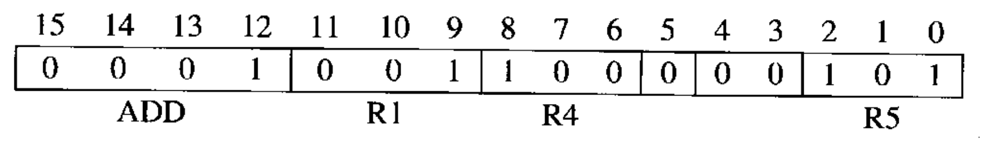
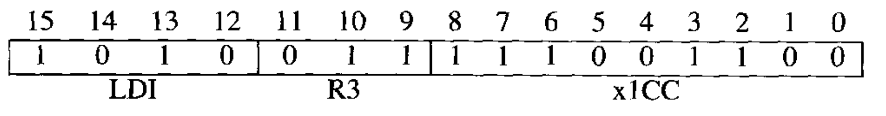
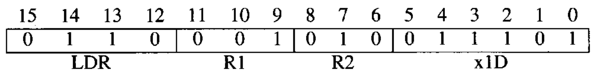
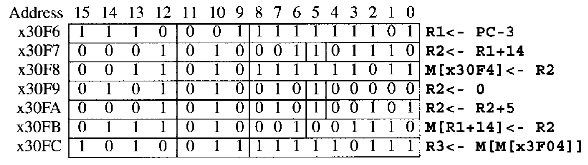

# LC-3

* ADD

  ```assembly
  ADD R6, R2, R6	#add r2 to r6, store the result in r6 
  ```

* LDR

  ```assembly
  LDR R2, R3, 6	#Add the contents of R3 to the value 6 to form the address of a memory location. Load the contents stored in that memory location into R2
  ```

### 4.3.2 Instruction Cycle

1. FETCH
2. DECODE
3. EVALUATE ADDRESS
4. FETCH OPERANDS
5. EXECUTE
6. STORE RESULT

* FETCH:
  Step 1: Load the MAR with the contents of the PC, and simultaneously increment the PC.
  Step 2: Interrogate memory, resulting in the instruction being placed in the MDR.
  Step 3: Load the IR with the contents of the MDR.
  PC存指令地址，IR存指令内容，从PC指向的指令开始运行，取出指令放到IR中，PC加一。
  Step1 3 只花费一个时钟周期，Step 2 要读内存可能要花费多个时钟周期
* DECODE
  通过一个decoder，操作码决定硬件上使用哪些过程。
* EVALUATE ADDRESS
  分析好地址，例如计算`LDR`中的基址加偏移，最后得到绝对的地址。
* FETCH OPERANDS
  取操作数，一般是从内存中取。
* EXECUTE
  执行，复杂指令执行的过程牵扯到更多的硬件结构
* STORE RESULT
  结果存储，继续从头开始


### 4.4 Changing the sequence

* 引入`JMP`，执行过程中更新PC的值，下一条指令直接跳转到指定的寄存器地址。

  ```assembly
  JMP R3
  ```

  这样明显存在一个问题，`JMP`后就无法返回原始顺序执行的位置。

* 核心的控制单元是一个有限状态机模型，不断执行指令周期，并根据指令内容在不同的指令周期中进行转换


### 4.5 Stopping the machine

* 停止程序运行需要停止时钟信号，直接通过一个与门让时钟信号跟SR触发器相连，控制开关即可控制时钟信号开关。


## ISA

### 数据计算

* `NOT`，LC-3中唯一一个一元操作码。

  ```assembly
  NOT R3, R5	#R3 is destination. *R3 = NOT *R5
  ```

* `ADD`，二元操作码，可以加立即数，也可以加寄存器。

  ```assembly
  ADD R1, R4, R5	#R1 is destination. R1 = R4 + R5
  ADD R1, R4, -2	#加立即数，操作码第五位的0变为1
  ```

  
  

### 数据转移

* 数据转移指令：`LD`, `LDR`, `LDI`, `LEA`, `ST`, `STR`, `STI`

* PC-relative mode，相对PC寻址，`LD`, `ST`

  ```assembly
  LD R2, x1AF		# 当前指令的PC+1，加上x1AF扩展为16位，即xFFAF,取结果的地址。
  ```

  寻址范围只有 -256~255.

* Indirect Mode，间接寻址，`LDI`, `STI`

  ```assembly
  LDI R3, x1CC	#与LD相同，最后取PC+1+xFFCC地址内的内容写入R3.
  ```

  

* Base+ Offset Mode, 基址加偏移寻址，`LDR`, `STR`

  ```assembly
  LDR R1, R2, x1D		
  ```

  
  偏移只有6位，寻址-32~31

* Immediate Mode，立即数寻址，`LEA`（load effective address）

  ```assembly
  LEA R5, #-3		# PC+1-3, 计算出来的地址直接写入R5
  ```

  `LEA`是唯一的不用读内存的读指令，而其他`LD`, `LDR`读一次内存，`LDI`读两次内存。

* Example:
  

  ```assembly
  LEA R1, -3		# R1:x30F4, PC:x30F7
  ADD R2, R1, 14	# R2:x3102(R1 + 14), PC:x30F8
  ST R2, x1FB		# PC:x30F9, PC+xFFFB=x30F4, R2(x3102)写入M(x30F4).
  AND R2, R2, 0	# PC:x30FA, 扩展5位小数至16位，与操作. R2:0
  ADD R2, R2, 5	# PC:x30FB, R2:5;
  STR R2, R1, 14	# PC:x30FC, R1(x30F4)+x000E=x3102, R2(5)写入M(x3102)
  LDI R3, x1F7	# PC:x30FD, PC+xFFF7 = x30F4, M(M(x30F4))=M(x3102)=5
  ```


### 控制指令

* 此前的操作都不会影响PC的递增，控制指令可以影响PC的递增，改变代码运行顺序。

* 引入`BR`指令，

  ```assembly
  BR nzp x0D9		# PC:x4028, PC+x0D9= x4101, PC 被覆盖为x4101.此处无条件跳转
  ```

  检测上一步寄存器操作的条件码，若满足则改变PC的值。
  可以跳转即可实现循环。
  
  实现了从`x3100`一直递增向量的和，直至遇见负数停止。

* `JMP`指令，无条件跳转至某一指令地址

  ```assembly
  JMP R2		# PC <- R2
  ```

* `TRAP`指令，系统调用命令

  ```assembly
  TRAP x23		#8位的trapvector
  ```

  常用的：

  * Input a character from the keyboard (trapvector = x23). 
  * Output a character to the monitor (trapvector = x21). 
  * Halt the program (trapvector = x25).

  后续结合系统学习。

* 

