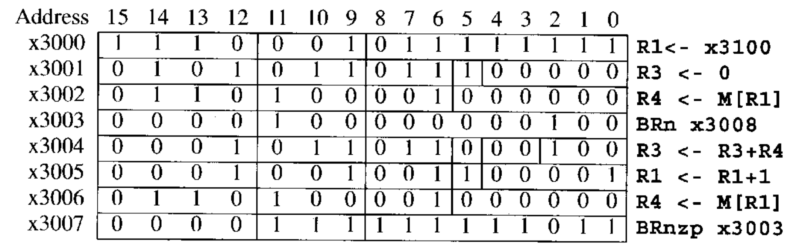

# LC-3

* ADD

  ```assembly
  ADD R6, R2, R6	#add r2 to r6, store the result in r6 
  ```

* LDR

  ```assembly
  LDR R2, R3, 6	#Add the contents of R3 to the value 6 to form the address of a memory location. Load the contents stored in that memory location into R2
  ```

### 4.3.2 Instruction Cycle

1. FETCH
2. DECODE
3. EVALUATE ADDRESS
4. FETCH OPERANDS
5. EXECUTE
6. STORE RESULT

* FETCH:
  Step 1: Load the MAR with the contents of the PC, and simultaneously increment the PC.
  Step 2: Interrogate memory, resulting in the instruction being placed in the MDR.
  Step 3: Load the IR with the contents of the MDR.
  PC存指令地址，IR存指令内容，从PC指向的指令开始运行，取出指令放到IR中，PC加一。
  Step1 3 只花费一个时钟周期，Step 2 要读内存可能要花费多个时钟周期
* DECODE
  通过一个decoder，操作码决定硬件上使用哪些过程。
* EVALUATE ADDRESS
  分析好地址，例如计算`LDR`中的基址加偏移，最后得到绝对的地址。
* FETCH OPERANDS
  取操作数，一般是从内存中取。
* EXECUTE
  执行，复杂指令执行的过程牵扯到更多的硬件结构
* STORE RESULT
  结果存储，继续从头开始


### 4.4 Changing the sequence

* 引入`JMP`，执行过程中更新PC的值，下一条指令直接跳转到指定的寄存器地址。

  ```assembly
  JMP R3
  ```

  这样明显存在一个问题，`JMP`后就无法返回原始顺序执行的位置。

* 核心的控制单元是一个有限状态机模型，不断执行指令周期，并根据指令内容在不同的指令周期中进行转换


### 4.5 Stopping the machine

* 停止程序运行需要停止时钟信号，直接通过一个与门让时钟信号跟SR触发器相连，控制开关即可控制时钟信号开关。


## ISA

### 数据计算

* `NOT`，LC-3中唯一一个一元操作码。

  ```assembly
  NOT R3, R5	#R3 is destination. *R3 = NOT *R5
  ```

* `ADD`，二元操作码，可以加立即数，也可以加寄存器。

  ```assembly
  ADD R1, R4, R5	#R1 is destination. R1 = R4 + R5
  ADD R1, R4, -2	#加立即数，操作码第五位的0变为1
  ```

  
  

### 数据转移

* 数据转移指令：`LD`, `LDR`, `LDI`, `LEA`, `ST`, `STR`, `STI`

* PC-relative mode，相对PC寻址，`LD`, `ST`

  ```assembly
  LD R2, x1AF		# 当前指令的PC+1，加上x1AF扩展为16位，即xFFAF,取结果的地址。
  ```

  寻址范围只有 -256~255.

* Indirect Mode，间接寻址，`LDI`, `STI`

  ```assembly
  LDI R3, x1CC	#与LD相同，最后取PC+1+xFFCC地址内的内容写入R3.
  ```

  

* Base+ Offset Mode, 基址加偏移寻址，`LDR`, `STR`

  ```assembly
  LDR R1, R2, x1D		
  ```

  
  偏移只有6位，寻址-32~31

* Immediate Mode，立即数寻址，`LEA`（load effective address）

  ```assembly
  LEA R5, #-3		# PC+1-3, 计算出来的地址直接写入R5
  ```

  `LEA`是唯一的不用读内存的读指令，而其他`LD`, `LDR`读一次内存，`LDI`读两次内存。

* Example:
  

  ```assembly
  LEA R1, -3		# R1:x30F4, PC:x30F7
  ADD R2, R1, 14	# R2:x3102(R1 + 14), PC:x30F8
  ST R2, x1FB		# PC:x30F9, PC+xFFFB=x30F4, R2(x3102)写入M(x30F4).
  AND R2, R2, 0	# PC:x30FA, 扩展5位小数至16位，与操作. R2:0
  ADD R2, R2, 5	# PC:x30FB, R2:5;
  STR R2, R1, 14	# PC:x30FC, R1(x30F4)+x000E=x3102, R2(5)写入M(x3102)
  LDI R3, x1F7	# PC:x30FD, PC+xFFF7 = x30F4, M(M(x30F4))=M(x3102)=5
  ```


### 控制指令

* 此前的操作都不会影响PC的递增，控制指令可以影响PC的递增，改变代码运行顺序。

* 引入`BR`指令，

  ```assembly
  BR nzp x0D9		# PC:x4028, PC+x0D9= x4101, PC 被覆盖为x4101.此处无条件跳转
  ```

  检测上一步寄存器操作的条件码，若满足则改变PC的值。
  可以跳转即可实现循环。
  
  实现了从`x3100`一直递增向量的和，直至遇见负数停止。

* `JMP`指令，无条件跳转至某一指令地址

  ```assembly
  JMP R2		# PC <- R2
  ```

* `TRAP`指令，系统调用命令

  ```assembly
  TRAP x23		#8位的trapvector
  ```

  常用的：

  * Input a character from the keyboard (trapvector = x23). 
  * Output a character to the monitor (trapvector = x21). 
  * Halt the program (trapvector = x25).

  后续结合系统学习。

* 

### 汇编语言

* 主要有四部分构成：
  Label Opcode Operands; Comments	
  Label和Comments均是可选的

* Pseudo-Ops(Assembler Directives)伪操作，汇编指令
  LC-3中一共有5个Pseudo-Ops：

  * .ORIG：程序起始地址

  * .FILL：补充Label的具体含义

    ```assembly
    SIX    .FILL    x0006
    ```

  * .BLKW(a Block of Words)：开辟连续的字空间，感觉类似系统调用

  * .STRINGZ：开辟连续的字符串空间，并以一个`x0000`空字符结尾。

    ```assembly
    		.ORIG		x3010
    HELLO	.STRINGZ 	"Hello, World!"
    ```

    开辟了14个连续的内存地址，从x3010到x301D.

  * .END：源程序的结尾，后面的代码都会被忽略。事实上在寄存器中没有.END（个人理解也没.ORIG)。

  * 事实上后续又补充了一个.EXTERNAL，用来表示引用外部的标签。


### 7.3 汇编过程

​	总体上是一个Two-pass process

* Pass 1: 
  遍历整个汇编代码文件，从`.ORIG`到`.END`。
  有一个location counter(LC)，用来记录汇编语句的地址；如果从x3000地址开始，则每逢一次汇编语句LC就加1。
  顺次生成一个symbol table，用来记录label的地址。

* Pass 2:

  逐行扫描汇编代码，逐行翻译成机器指令，遇到Label就解析symbol table中对应的地址到机器码中

  例如：

  ```assembly
  	.ORIG	x3000
  	AND	R2,R2,#0
  	LD	R3,PTR
  	TRAP	x23
  	LDR	R1,R3,#0
  TEST	ADD	R4,R1,#-4
  	BRz	OUTPUT
  	NOT	R1,R1
  	ADD	R1,R1,R0
  	NOT	R1,R1
  	BRnp	GETCHAR
  	ADD	R2,R2,#1
  GETCHAR ADD	R3,R3,#1
  	LDR	R1,R3,#0
  	BRnzp	TEST
  OUTPUT	LD	R0,ASCII
  	ADD	R0,R0,R2
  	TRAP	x21
  	TRAP	x25
  ASCII	.FILL	x0030
  PTR	.FILL	x4000
  	.END
  ```

  在LC = x3001时遇到了Label`PTR`，此时的PC为x3002，`PTR`在表中对应的地址是x3013，则`LD`的操作数偏移量为x3013-x3002=x0011(二进制为10001)。`LD`对应机器码为`0010`，`R3`对应的机器码为`011`。本行代码被汇编为：`0010 011 0 00010001`。当PCoffset的值过大时，超过了-256~255的范围时，汇编报错。


### 7.4 链接过程

* 汇编生成的.obj文件被链接成executable image，即常用的`.exe`文件。

* 此处引入了.EXTERNAL伪指令。例如：

  ```assembly
  PTR		.FILL		STARTofFILE
  		.EXTERNAL	STARTofFILE
  ```

  assembler不会报错，后续的linker会利用外部引用的伪指令以及根据不同obj之间的symbol table完成链接。


## 8 Data Structures

## 8.1 Subroutines

​		同一种功能的代码需要多次写，如何避免多次写？事实上可以理解为子函数是怎样实现的。

​		引入`JSR`指令，功能是：下一条指令的地址被存到R7中，程序执行相应地跳到JSR对应地LABEL的位置。

​		调用子函数的时候，register中的值会被存放起来，调用完之后再恢复。具体来讲，有两种模式，caller save和callee save，可以理解为主函数save或者是子函数save。

### 8.2 Stack

​		栈，后进先出。
​		LC-3中，R6是stack pointer；R5用来检测是否pop成功，0为成功，1代表失败。

​		完整的Underflow 以及Overflow的过程：

```assembly
PUSH 	AND 	R5,R5,#0
		LD		R1,MAX
		ADD		R2,R6,R1
		BRz		Failure
		ADD		R6,R6,#-1
		STR		R0,R6,#0
		RET
Failure	ADD		R5,R5,#1
		RET
MAX		.FILL	xc005		;-x3FFB
```

​	

```assembly
POP		AND		R5,R5,#0
		LD		R1,EMPTY
		ADD		R2,R6,R1
		BNz		Failure
		LDR		R0,R6,#0
		ADD		R6,R6,#1
		RET
Failure	ADD		R6,R6,#1
		RET
EMPTY	.FILL	xC000		;-x4000
```

### 8.3 Recursive

### 8.4 Queue

​		队列先进先出，不包含Front但是包含Rear，和一般C的前闭后开不同，入堆的地址由低到高。

​		引入循环队列，相当于把这一段连续地址首尾相接。如果Front到达了尾部仍然需要出队列，则将Front挪动至最低地址，当然前提是Rear此时和Front不相等。同样地，Rear如果想入队列时，如果遇到了尾地址，则挪动至首地址，前提是此时首地址不是Front。对于n个地址的循环队列，最多存储n-1个元素。Front=Rear时，队列为空；地址转换成补码形式下如果 Front=Rear+1，则队列满。

### 8.5 Character Strings

​		其实即`string`，ASCII码，`x0000`表示字符串结束。在LC-3里，一个ASCII码占一个字，需要扩充。


## 9 I/O

​		处理器不断询问I/O是否就绪，然后再进行输入输出操作，是“polling”的方式，而相反地，I/O主动高速处理器有输入或者可以输出，是“Interrupt-Driven”的交互方式。以下是两种polling：

* 键盘的输入，可以通过异步的方式进行，设置KBDR(data register)和一个KBSR(status register).（这里叫register，事实上就是LC-3内特定的内存地址，KBDR对应xFE02，KBSR对应xFE00）。
  只考虑8位的ASCII码输入，则KBDR高8位均为0，KBSR最高位1代表已经输入了字符，0表示没有。

  ```assembly
  START	LDI		R1,A
  		BRZP	START
          LDI		R0,B
          BRNZP	NEXT_TASK
  A		.FILL	XFE00
  B		.FILL	XFE02
  ```

  可以通过以上的过程检测输入与否，一旦输入了数据，KBSR就会置1，然后R0内读入对应地址内的数据。

* 类似地，显示器也存在DDR(Display Data Register)和DSR(Display Status Register):

  ```assembly
  		LEA		R1, Prompt
  Loop	LDR		R0, R1,#0
  		BRz		NEXT_TASK
  L2		LDI		R3,DSR
  		BRzp	L2			;Loop until monitor is ready!
  		STI		R0,DDR		;Write next prompt character
  		ADD		R1,R1,#1	;Increment prompt pointer
  		BRnzp	Loop		;Get next prompt character
  Prompt	.STRINGZ	"Input a character here>"
  ```

  以上逐个打印出字符串，R1实际上存指针变量，R0存的数据。每打印一个字符都需要检测monitor是否ready，实际上也是一种“polling”式的交互方式。


​		“interrupt I/O"实际上就是中断的方式，处理器不用一直询问I/O是否就绪，而是I/O产生一个中断信号，如果优先级(PL)高于现有的程序，就建一个stack，开始处理I/O（例如键盘输入）。后续会学习如何建立stack。


## 9.3 Operating System Service Routines

* 系统调用`TRAP`，主要的目的是为了防止低优先级的程序员访问某部分内存导致错误，系统写好了一部分程序供调用。
* PSR(Processor Status Register)，最高位0代表超级权限，一共有7个PL(Privilege Level)
  
* `TRAP`做了三件事：
  * 将和PC压入system stack中，而不是user stack。
  * PSR最高位置0，代表超级权限。PSR[10:8]不变。
  * 扩展代码中的trap vector至16位，将该处存的地址载入PC中。
* `RTI`, 将system stack中的PC和PSR出栈。


